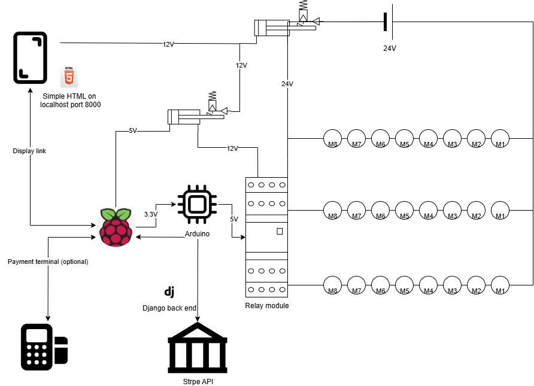

# VendOS

**Open source Python-based vending machine software** for the Raspberry Pi, built with **Django**.  

VendOS provides a simple web-based interface to control vending machine motors, making it easy to test, configure, and deploy a vending machine using a Raspberry Pi.

---

## Features

- Web-based **test panel** with buttons for each motor  
- Works with **16 motors** by default (configurable)  
- Optional **mock GPIO mode** for testing without a physical Raspberry Pi  
- Responsive UI using **Bootstrap**  
- Simple **Django backend** for motor control  
- Easily extendable for real-world vending applications  

---

## Requirements

- **Hardware**: 
  - Raspberry Pi with GPIO-pins to run your motors
  - Arduino so 5V signals can be sent to a relay.
  - Relay board: we used a 16 module board to run the motors.

- **Software**:
  - Python 3.10+  
  - Django 4+  
  - RPi.GPIO or gpiozero (optional, mocked in dev)  
  - Bootstrap (loaded via CDN)  
  - Ngrok, this way no domain is needed and everything runs via localhost
  - Stripe is used to provide card payments. 
  - (optional) use NGROK to send traffic to the local host of the machine, meaning one does not nessesarily need to configure the pi as a server.

---

## How to set this up

To get up and running you will need some knowledge of electrical cirquits and programming. This repo also does not contain code for the arduino. This repo gives a web based interface that talks to the arduino. The arduino handels the rest. A basic scheme of how this can function is given below:

## Development Status

**VendOS is currently under active development.**  

The project is in the early stages, focusing on creating a robust and flexible vending machine control system for the Raspberry Pi using Django. Features like motor control, test panel UI, and GPIO integration are being built and refined.

**Contributions are very welcome!**  

Whether you want to:
- Improve the UI/UX  
- Add new features (inventory tracking, sensor integration, etc.)  
- Optimise GPIO handling or motor control  
- Help with documentation or testing  

Feel free to fork the repository, submit issues, or create pull requests. Your help is appreciated and will make VendOS better for everyone.
